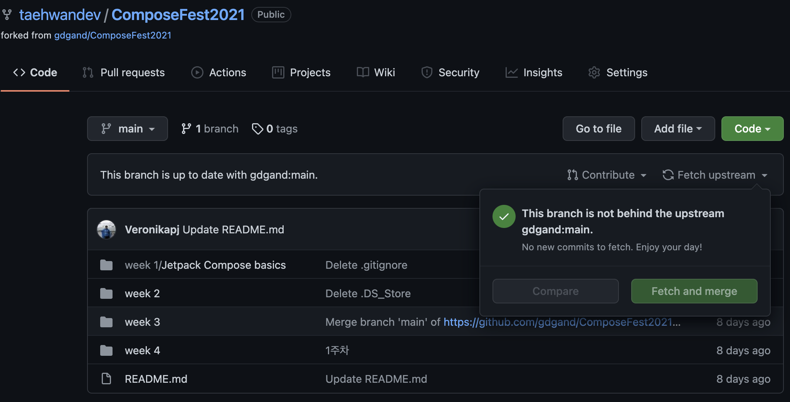
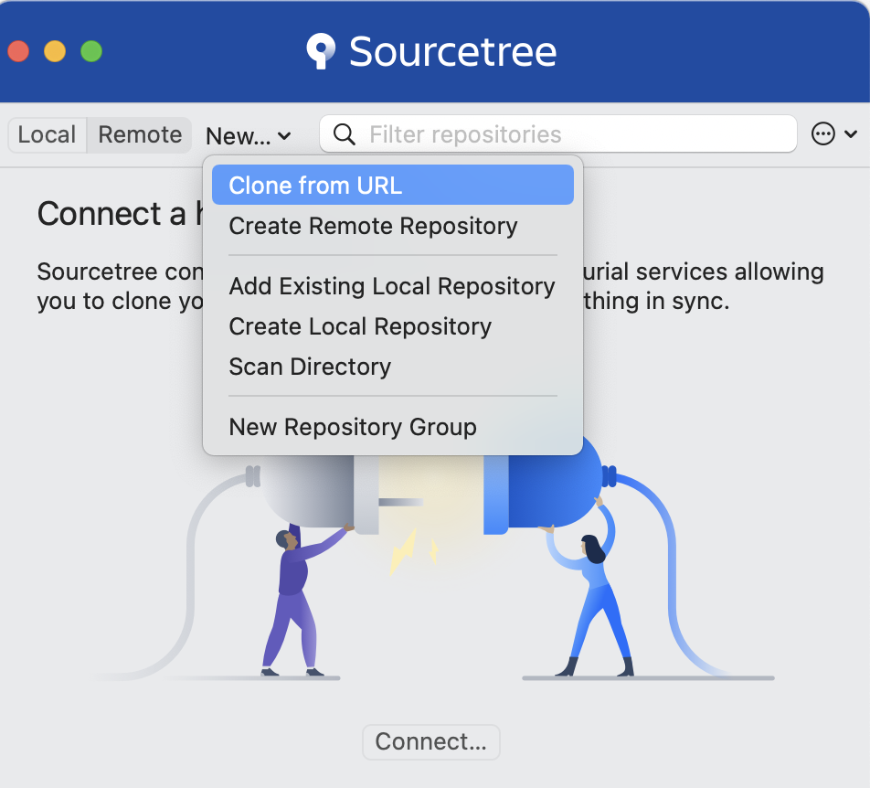
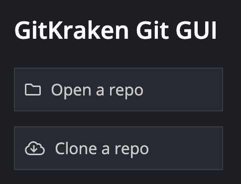

# ComposeFest2021

안녕하세요 Compose 코드랩에 오신걸 환영합니다.  
다음은 코드랩을 진행하기 위한 안내입니다.
<br/><br/>
## 진행 일정
2021년 11월 1일 ~ 30일   
매주 월요일 코드랩 진행을 돕기 위한 주요 설명 영상을 공개합니다.   
👉 [영상 보러가기](https://sites.google.com/view/devfest-korea-2021/compose-codelab)
<br/><br/>

## Compose 코드랩
- [Pathway 보러가기](https://developer.android.com/courses/pathways/compose)
- [원본 코드랩 링크](https://github.com/googlecodelabs/android-compose-codelabs)
<br/>

## 준비물
- [Android Studio Arctic Fox](https://developer.android.com/studio)
- 오픈 카톡방 참여 (https://open.kakao.com/o/gQSlqyEd)

<br/>

## Repo fork 하기

1. Github 페이지 오른쪽 상단 위의 fork 클릭
    

2. fork 브랜치를 어디에 만들 것인지 묻는 팝업이 뜹니다. 신청서에 작성해주신 자신의 Github 계정을 선택해줍니다.
    

3. fork 브랜치가 자신의 계정 아럐 생성되면 완료입니다.
    

4. fork 브랜치는 main 브랜치에 영향을 주지 않습니다. 마음껏 코드랩을 진행해보세요!

<br/>

## 코드랩 진행하기
1. 자신의 fork 브랜치를 로컬로 가져오기 위해 원하는 위치에서 github 주소를 복사합니다.


    git clone 으로 fork 한 개인 브랜치를 로컬로 다운 받습니다.
    ```
    ~$ git clone https://github.com/gdgand(개인Github 아이디)/ComposeFest2021.git
    ```

2. 일정 별 각 주차에 맞는 폴더 위치에서 코드랩을 진행합니다.
    (~/week 1,2,3,4/Compose .../XXXComposeCodelab)
    - 각 주차 별 시작할 수 있는 코드랩 코드가 주차 별로 포함되어 있습니다. 바로 열어서 코드랩을 시작하실 수 있습니다.
    - 다만, 새로 프로젝트를 생성해서 시작하는 경우에는 프로젝트 추가가 필요합니다. 해당 프로젝트는 아래의 두 개 입니다.
        1. 1주차 Jetpack Compose basics
        2. 2주차 Layouts in Jetpack Compose  
    

3. 각각의 코드랩을 진행합니다.


4. 완성된 코드를 개인 fork 브랜치로 push해서 업데이트 합니다.
5. 코드랩 수료확인을 위해 직접 진행한 코드 commit 히스토리를 꼭 남겨주세요!

<br />

## 매주 공개되는 자료를 최신화 하기 - GUI로 사용하는 방법

자신의 GitHub에서 Fetch upstream 버튼을 찾아 눌러주세요. 최신화가 필요하다면 Fetch and merge 초록색 버튼을 눌러주면 최신화를 할 수 있습니다.
(만약 'This branch is X commits behind gdgand:main.'와 같은 메시지가 보이는데 초록색 버튼이 disable 상태라면 새로고침을 눌러주고, Fetch를 눌러주세요.)



본 프로젝트는 각각의 폴더가 안드로이드 스튜디오 프로젝트로 구성되어있습니다.

ComposeFest2021 폴더를 바로 Android Studio로 열수없고, week 별로 실행할 수 있습니다.

[SourceTree](https://www.sourcetreeapp.com/), [GitKraken](https://www.gitkraken.com/) 등을 이용하시면 됩니다.

### SourceTree 사용

SourceTree를 설치하고, Clone 할 수 있습니다.

SourceTree 설치 방법은 아래 글을 참고하세요.(SourceTree 사용 방법은 검색을 통해 확인 부탁드립니다.)

[SourceTree 윈도우 사용 방법](https://devkoboso.com/entry/github-sourcetree-%EC%82%AC%EC%9A%A9%EB%B2%95)



### GitKraken 사용

GitKraken을 실행하고, Clone a repo를 열어줍니다.

[GitKraken 사용 방법](https://kindle14.tistory.com/50?category=963674)




<br />

## 매주 공개되는 자료를 최신화 하기 - 명령어로 사용하는 방법
(메인 브랜치와 Sync 맞추는 방법)

1. 현재 fork 한 remote 브랜치 확인
    ```
    $ git remote -v
    origin	https://github.com/YOUR_NAME/ComposeFest2021.git (fetch)
    origin	https://github.com/YOUR_NAME/ComposeFest2021.git (push)
    ```
2. upstream 으로 gdgand 브랜치 추가하기
    ```
    $ git remote add upstream https://github.com/gdgand/ComposeFest2021.git
    ```
3. 잘 추가되었는지 확인하기
    ```
    $ git remote -v
    origin	https://github.com/YOUR_NAME/ComposeFest2021.git (fetch)
    origin	https://github.com/YOUR_NAME/ComposeFest2021.git (push)
    upstream	https://github.com/gdgand/ComposeFest2021.git (fetch)
    upstream	https://github.com/gdgand/ComposeFest2021.git (push)
    ```
4. 최신 업데이트 확인하기
    ```
    $ git fetch upstream
    remote: Enumerating objects: 706, done.
    .. 이하 생략
    ```
5. 내 remote fork 브랜치와 머지하기
    ```
    $ git merge upstream/main
    ```
6. 변경사항 push 하기
    ```
    $ git push origin main
    ```
